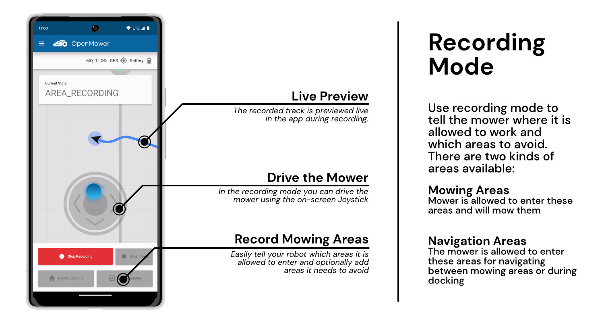

## What is Open Mower?

If you want to see a quick overview, you can check out this video:

Let's be honest: The current generation of robotic lawn mowers sucks. Basically, all of these bots drive in a random direction until they hit the border of the lawn, rotate for a randomized duration and repeat. **I think we can do better!**

Therefore, we have disassembled the cheapest off-the-shelf robotic mower we could find ([YardForce Classic 500](https://amzn.to/3NWgIxk)) and were surprised that the hardware itself is actually quite decent:
- Geared sensored brushless motors for the wheels
- A sensored brushless motor for the mower motor itself
- The whole construction seems robust, waterproof and all in all thought through
- All components are connected using standard connectors, therefore, upgrading the hardware is easily possible.

The bottom line is: The bot itself is surprisingly high quality and doesn't need to be changed at all. **We just need some better software in there**.

## Important Information

OpenMower is an early stage open source project, **and not a finished product!**

This basically means: I'm just documenting a project of mine here for free, and I don't have the time and resources to check that devices built using this information will be safe to use, legal to use or even work as intended. You will need technical know-how to use this project, and I'm not liable for any direct or indirect damages your actions do to anyone or anything. [More Info](/docs/getting-started/#important-info)

## Project Goals / Current State

The basic mowing function finally works! As you can see in the video, map teaching and mowing work as expected. It even returns to the docking station automatically as soon as the battery gets low and continues once it's recharged. Of course, we don't want to stop there, and we want to provide some more great features.

**Here is a rough overview of what works and what's planned for the future:**

:heavy_check_mark: **Autonomous Lawn Mowing:** Obviously, the device should be able to mow the lawn automatically.

:heavy_check_mark: **Good Safety:** The device must be safe, e.g. emergency stop if lifted or crashed.

:heavy_check_mark: **No Perimeter Wire Needed:** We want to be flexible and support multiple mowing areas.

:heavy_check_mark: **Low Cost:** It should be cheaper than a mid-range off-the-shelf product

:heavy_check_mark: **Open:** I want to share knowledge and enable others to build an OpenMower as well.

:heavy_check_mark: **Nice to Look At:** You should not be ashamed to have an OpenMower mowing your lawn.

:wrench: **Usability:** The mower should be easy to use. For now, the mower is controlled via ssh terminal and has no app or other graphical user interface. Also, the mowing needs to be triggered manually. There is no schedule implemented yet.

:wrench: **Smart Home:** The mower should be connected to your smart home. This way you can see what it is currently doing and also start it automatically, according to your own rules.

:wrench: **Avoid Obstacles:** The mower should detect obstacles and avoid them during mowing. For now, if the mower is not able to drive the path successfully, it will skip a part of the path and retry.

:wrench: **Rain Detection:** The device should be able to detect bad weather conditions and pause mowing until they improve.

:wrench: **Support More Mowers:** Currently the only mower officially supported is the YardForce Classic 500. This is because the current mainboard revision fits in this mower. The goal is to create modular hardware which can be used in other mower models as well (with an adaptor of course).

## Open Mower App 

## Where should I go next?

If you are interested in joining the Open Mower project, you can build your own by checking the following pages:
* [Getting Started](/docs/getting-started/): Read this if you want to start building quickly
* [Links](/docs/links): Links to more information, the repositories and the shop.
