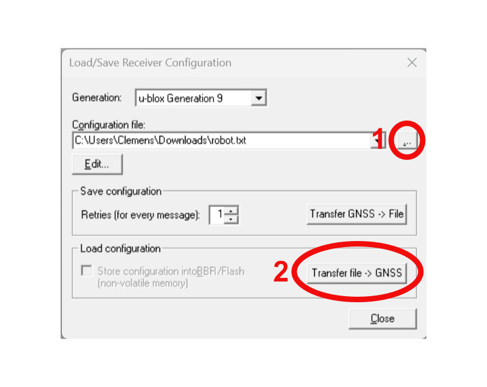
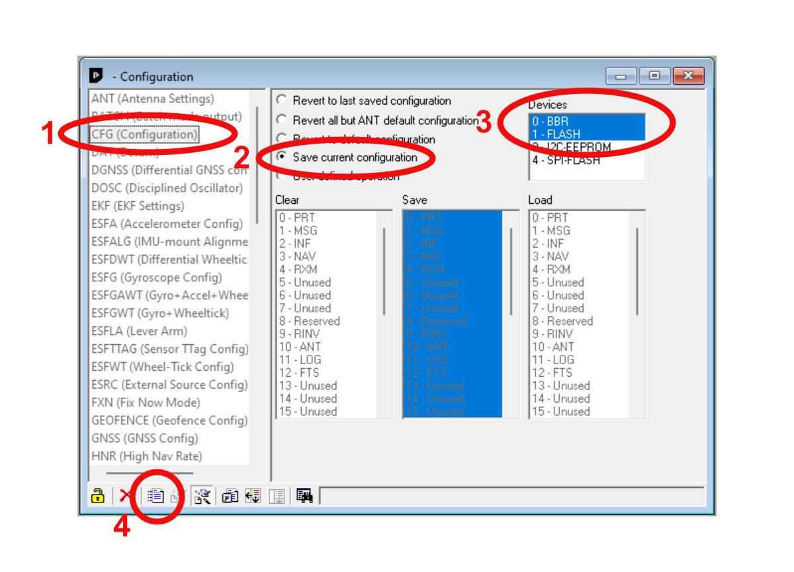

{}
There is a tutorial video available for this step of the process!  
Check my YouTube video here: [<i class="fa fa-brands fa-youtube"></i> Video](https://youtu.be/_bImqD-pQSA?t=981)
(time 16:21 - 17:15)
{}

## Configure the GPS board
This assumes that you are using the Ardusimple F9P GPS board. Support for other GPS receivers is work in progress.

### Prerequisites

- **A Micro USB Cable**
- **A Windows PC**
- **Latest version of the u-center software:** 
  :link:&nbsp;[https://www.u-blox.com/en/product/u-center](https://www.u-blox.com/en/product/u-center) 
  Don't get u-center V2, you will need u-center v1 for the F9P.
- **The GPS configuration file** 
  :link:&nbsp;<a href="https://raw.githubusercontent.com/ClemensElflein/OpenMower/main/configs/GPSConfig/Robot.txt" target="_blank">Robot.txt</a> 
  This will open in the browser. Use CTRL+S to download the file.

### Step 0: Update Firmware
Update the firmware of your Ardusimple board to version `ZED-F9P HPG 1.32`. There's a guide on the [Ardusimple Website](https://www.ardusimple.com/zed-f9p-firmware-update-with-simplertk2b/).

### Step 1: Open u-center and connect to your GPS
After installing u-center, connect your Ardusimple board using the "Power+GPS" USB socket to your Windows computer. You should see the blue LEDs of the board come on and Windows should recognize the device as a COM port.
With the module connected to your PC, open the u-center software. 

In u-center, first connect to your board by selecting the appropriate COM port in the `Receiver > Connection` menu.

### Step 2: Transfer the configuration to the GPS

After successfully connecting to the board, you can transfer
the previously downloaded configuration file `Robot.txt` by opening the window `Tools > Receiver Configuration ...`. In this window you open the `Robot.txt` using the `...` button and then transfer the configuration to the GPS by clicking the `Transfer File -> GNSS` button.

### Step 3: Save configuration to Flash

In order to keep the GPS configured even after powering it down, you need to save the current configuration to Flash memory. In order to do this, select `View > Configuration View`. In the new window you need to select `CFG (Configuration)` in the list on the left side and then enable `Save current configuration`. Make sure that `0 - BBR` and `1 - FLASH` are both selected on the right side of the window. Once that's done, click the `Send` button in the lower toolbar of the window.

### Step 4: Done :tada:
Your GPS is now configured for use with the Open Mower software. You can disconnect it from your Windows PC.
